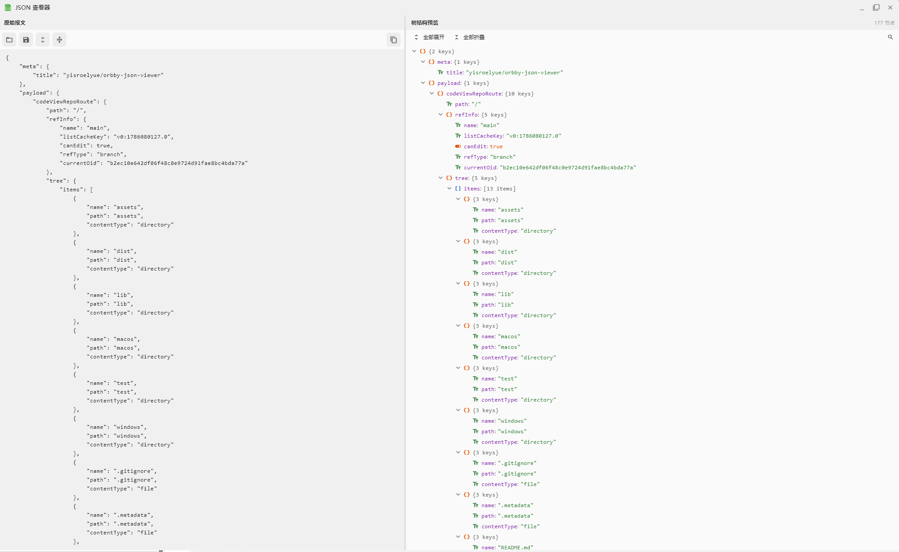

# Orbby JSON 查看器

基于 Flutter 开发的 Windows 桌面 JSON 工具：左侧编辑 / 粘贴原始报文，右侧实时渲染树形结构。

<p align="center">
  
</p>

## 下载

最新版本：[orbby_json_viewer_v1.0.0_windows_x64.zip](dist/orbby_json_viewer_v1.0.0_windows_x64.zip)

下载后解压到任意目录，运行 `orbby_json_viewer.exe` 即可，绿色免安装。

## 功能

- 编辑 / 粘贴 JSON，实时解析预览，语法错误提示
- 一键格式化（展开）、压缩
- 树形结构浏览，节点单行折叠 / 展开，支持全部展开 / 折叠
- 树内容支持拖动选中复制（Ctrl+C），右键节点可复制键名 / 值 / 路径 / 子树 JSON
- `Ctrl+F` 搜索键名或值：高亮命中项、自动展开所在分支、Enter 跳转下一个
- 打开 / 保存 JSON 文件，`Ctrl+S` 快速保存

## 构建

需要 Flutter 桌面开发环境，项目根目录执行：

```powershell
.\package.ps1   # 构建 Release 并生成 dist/ 下的版本压缩包
```

或只构建不打包：

```powershell
flutter build windows --release
```
